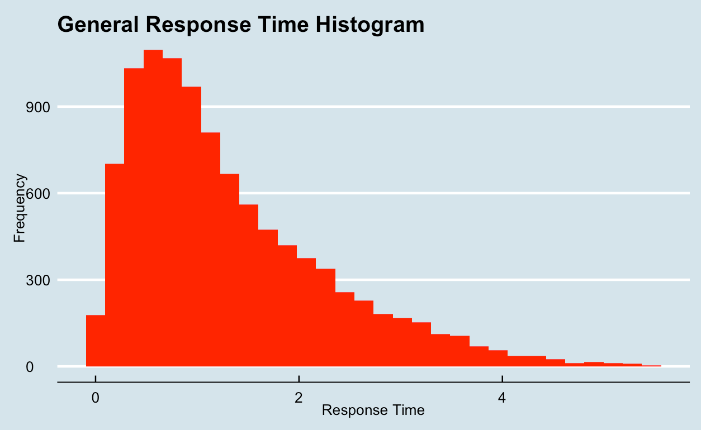

## I: Introduction

Starting in the Spring of 2021 all the way until the present, I have worked as an undergraduate research assistant in the Hegarty Spatial Thinking Lab headed by Professor Hegarty of UCSB's psychology department.  My main tasks were to assist various experiments with their data processing, cleaning, and visualizations.  The majority of my work has been focused on assisting an honors student named Nikita Gupta who graduated in 2021 after completing her honor's thesis for the psychology department.  The main goal of her project was to test the spatial ability and working memory of STEM learners by having them perform various tasks such as the cube comparison and paper folding tasks.  The entirety of her thesis can be found [here](Spatial Ability and Working Memory in STEM Learners (1).pdf).

******

## II: Data

My first task involved cleaning the data collected by Nickita so that I would later be able to score the tasks performed by each of the participants in her experiments.  Processing the data was a little rough as it was not collected in a very clean way.  However, after some time, I was able to format the data in a way that I could analyze it easily in R.  After separating the participants into "novices" and "naives" which represents STEM learners and non-STEM learners respectively, I was able to start scoring the tasks.  The first image below shows the first ten participants' scores for the cube comparison task which had a penalization of 1 point for every incorrect answer.  The second image shows the first ten participants' scores for the paper folding task which had a penalization of 0.25 points for every incorrect answer.

*****

*****

After obtaining the scores for both the tasks, I was asked to calculate an overall spatial score from the scores of the two tasks and compare the average spatial score between novies and naives.  In order to do this, I first normalized the scores by calculating the z-scores for all the participants for both tasks.  Then, a spatial score was created by averaging the z-scores for both the tasks.  I then created a column that differentiates between novice and naive and looked at the average spatial score for each group.  The first image below shows the first ten participants' spatial scores along with their z-scores for each task.  The second image shows that novices (STEM learners), had a higher average spatial score in comparison to naives (non-STEM learners).

*****

*****

After completing this, I passed the results on to Nickita who was now able to continue with her writeup for her thesis project.

******

## III: Visualization

In the following weeks, I was asked to do some analysis of the response times for another aspect of Nickita's experiment known as the rotation task which had participants look at molecular structures and how much it rotated.  More information about this task can be read in her paper.  I began by calculating the percentage of "no response" questions and the percentage of incorrect answers for each participant.  I was told to remove all participants who had an incorrect rate of over 50% which could skew the data as they were probably just guessing their way through the task.  I then created a histogram that displays the general response times for the rotation tasks.  Histogram shown below.

*****

I then performed further analysis by filtering to only correct answers to see the response times for questions that were answered correctly.  As seen below, the distribution looks similar to that of the general response time histogram.

*****

*****

Next, I wanted to see the mean response times based on the type of rotation task that the participant was shown.  First image shows the general mean response times, while the next two show the mean response times specific to whether or not they are a STEM learner or not.

*****

******

*****

As seen above, Single Swap rotations tend to have the highest average response time.  In addition, novices seem to have a higher average response time in comparison to naives for most types of rotation.  This could be explained by the fact that naives were truly guessing their way through the tasks while the STEM-learners who took organic chemistry were truly trying to figure out the correct answer.

I then ran a mixed linear regression in order to see all the variables, along with their interaction terms that were statistically significant in determining response time.  As seen below, the four interaction terms that were significant in determining response time were detection:rotation, detection:expertise, rotation:expertise, and detectSwap:expertise.

*****

One thing that I was pretty surprise about was the fact that expertise itself was not statistically significant in determining response time even though I graphically showed that novices have a higher average response time in comparison to naives.  